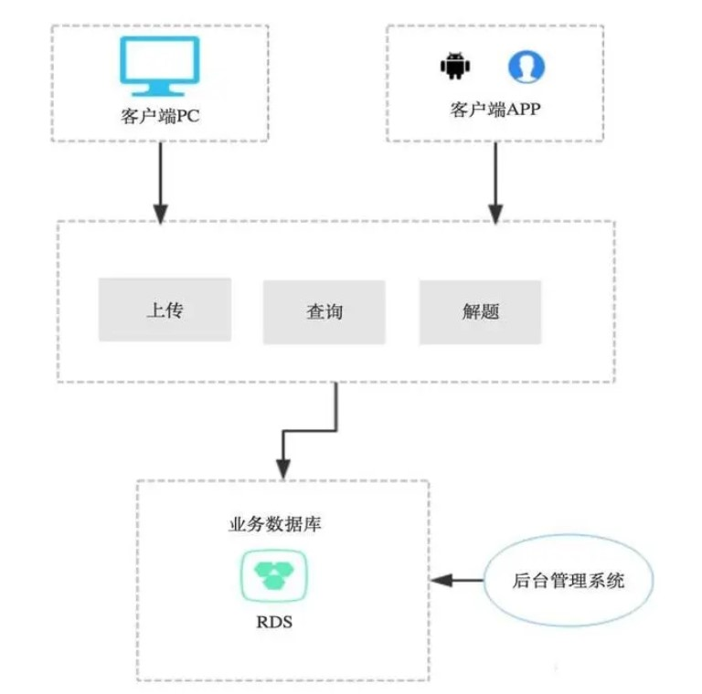
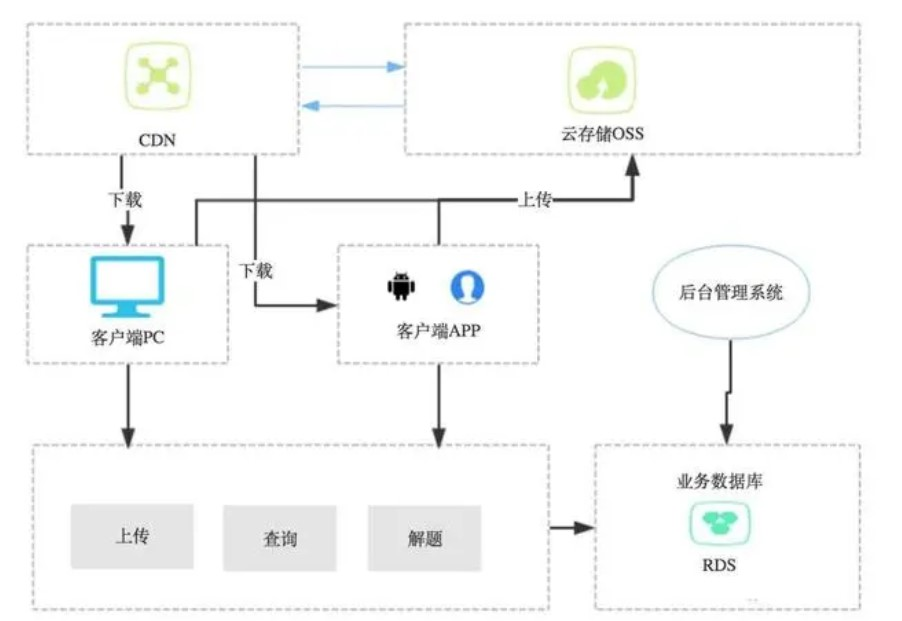
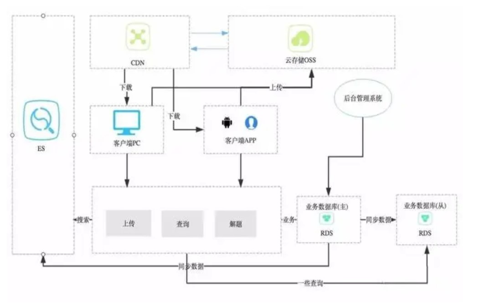
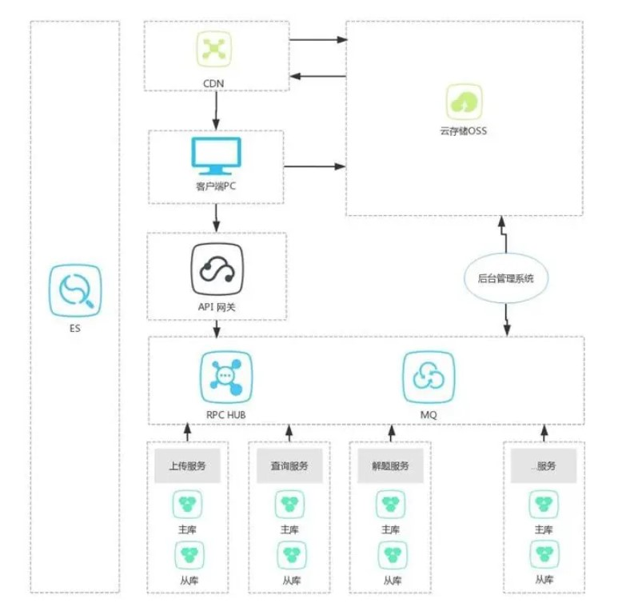
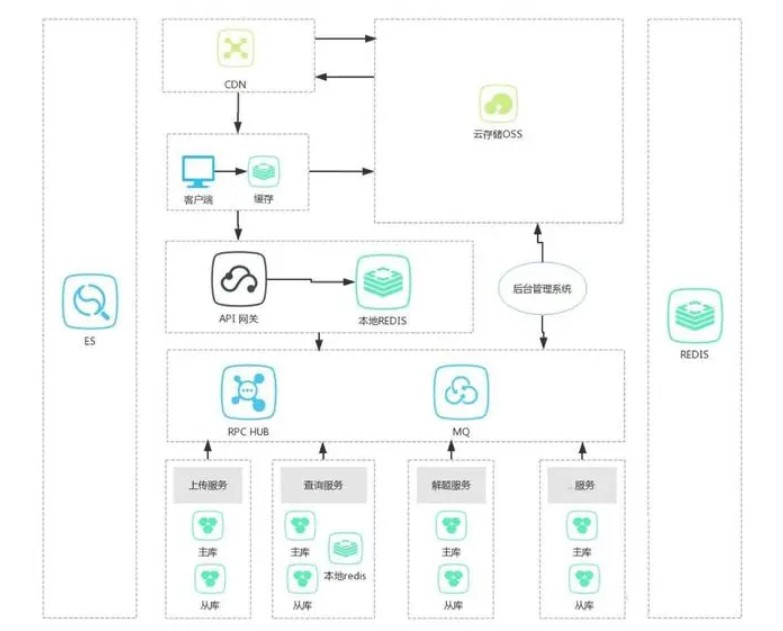
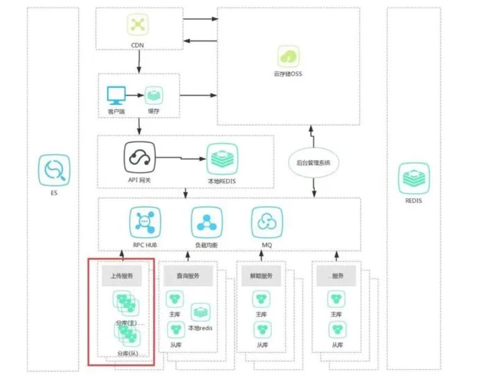
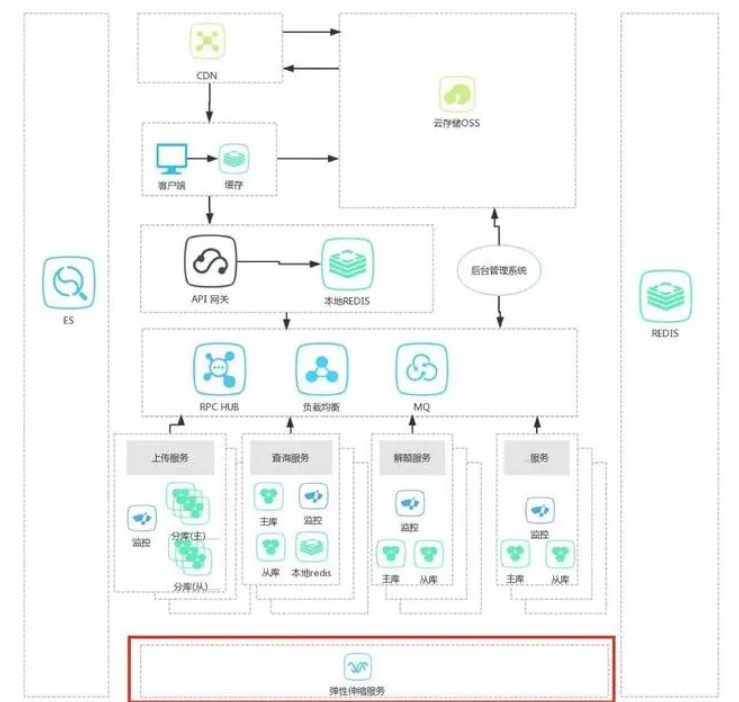
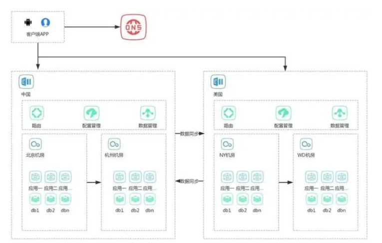

# 应用设计模式
### 单库单应用模式


这种模式一般只有一个数据库，一个业务应用层，一个后台管理系统，所有的业务都是用过业务层完成的，所有的数据也都是存储在一个数据库中的，好一点会有数据库的同步。虽然简单，但是也并不是一无是处。优点：结构简单、开发速度快、实现简单，可用于产品的第一版等有原型验证需求、用户少的设计。


> 缺点：性能差、基本没有高可用、扩展性差，不适用于大规模部署、应用等生产环境。


### 内容分发模式：目前用的比较多

>基本上所有的大型的网站都有或多或少的采用这一种设计模式，常见的应用场景是使用CDN技术把网页、图片、CSS、JS等这些静态资源分发到离用户最近的服务器。

```
一个典型的应用流程(以用户上传、查看图片需求为例)如下：

上传的时候，用户选择本地机器上的一个图片进行上传
程序会把这个图片上传到云存储OSS上，并返回该图片的一个URL
程序把这个URL字符串存储在业务数据库中，上传完成。
查看的时候，程序从业务数据库得到该图片的URL
程序通过DNS查询这个URL的图片服务器
智能DNS会解析这个URL，得到与用户最近的服务器(或集群)的地址A
然后把服务器A上的图片返回给程序
程序显示该图片，查看完成。

由上可知，这个模式的关键是智能DNS，它能够解析出离用户最近的服务器。运行原理大致是：根据请求者的IP得到请求地点B，然后通过计算或者配置得到与B最近或通讯时间最短的服务器C，然后把C的IP地址返回给请求者。
```

- 优点：资源下载快、无需过多的开发与配置，同时也减轻了后端服务器对资源的存储压力，减少带宽的使用。
- 缺点：目前来说OSS，CDN的价格还是稍微有些贵(虽然已经降价好几次了)，只适用于中小规模的应用，另外由于网络传输的延迟、CDN的同步策略等，会有一些一致性、更新慢方面的问题
  


### 查询分离模式：对于大并发的查询、业务

  **这种模式主要解决单机数据库压力过大，从而导致业务缓慢甚至超时，查询响应时间变长的问题，也包括需要大量数据库服务器计算资源的查询请求。这个可以说是单库单应用模式的升级版本，也是技术架构迭代演进过程中的必经之路。**

- 一个是业务数据库的主从分离，一个是引入了ES

> ES 用于大数据的查询服务

一个业界较成熟的方案就是**数据库的读写分离，写的时候入主库，读的时候读从库**。这样就把压力分散到不同的数据库了，如果一个读库性能不行，扛不住的话，可以**一主多从，横向扩展**。可谓是一剂良药啊！那怎么使用呢？一个一般的流程是这样的：

    服务端把一条业务数据落库
    数据库同步或异步或半同步把该条数据复制到从库
    服务端读数据的时候直接去从库读相应的数据

- 优点：减少数据库的压力，理论上提供无限高的读性能，间接提高业务(写)的性能，专用的查询、索引、全文(分词)解决方案。
- 缺点：数据延迟，数据一致性的保证。


### 微服务模式：适用于复杂的业务模式的拆解
**主要用于以下场景：**
*单机数据库写请求量大量增加，导致数据库压力变大
数据库一旦挂了，那么整个业务都挂了
业务代码越来越多，都在一个GIT里，越来越难以维护
代码腐化严重、臭味越来越浓
上线越来越频繁，经常是一个小功能的修改，就要整个大项目要重新编译
部门越来越多，该哪个部门改动大项目中的哪个东西，撕逼的厉害
其他一些外围系统直接连接数据库，导致一旦数据库结构发生变化，所有的相关系统都要通知，甚至对修改不敏感的系统也要通知
每个应用服务器需要开通所有的权限、网络、FTP、各种各样的，因为每个服务器部署的应用都是一样的*



业务分块，做了**垂直切分**，切成一个个独立的系统，每个系统各自衍化，有自己的库、缓存、ES等辅助系统，系统之间的实时交互通过**RPC**，异步交互通过**MQ**，通过这种组合，共同完成整个系统功能。
- **优点**：相对高性能，可扩展性强，高可用，适合于中等以上规模公司架构。
- **缺点**：复杂、度不好把握。指不仅需要一个能在高层把控大方向、大流程、总体技术的人，还需要能够针对各个子系统有针对性的开发。把握不好度或者滥用的话，这个模式适得其反！


### 多级缓存模式：可以把缓存玩的很好

**一般在三个地方加入缓存，一个是客户端处，一个是API网关处，一个是具体的后端业务处，下面分别介绍。**
**客户端处缓存**：这个地方加缓存可以说是效果最好的---无延迟。因为不用经过长长的网络链条去后端业务处获取数据，从而导致加载时间过长，客户流失等损失。虽然有CDN的支持，但是从客户端到CDN还是有网络延迟的，虽然不大。具体的技术依据不同的客户端而定，对于WEB来讲，有**浏览器本地缓存、Cookie、Storage、缓存策略**等技术；对于APP来讲，有**本地数据库、本地文件、本地内存、进程内缓存支持**。如果客户端缓存没有命中，那么就会去后端业务拿数据，一般来讲，都会有个API网关，在这里加缓存也是非常有必要的。
**API网关处缓存**：这个地方加缓存的好处是不用把请求发送到后方，直接在这里就处理了，然后返回给请求者。常见的技术，如http请求，API网关用的基本都是**nginx**，可以使用*nginx本身的缓存模块*，也可以使用Lua+Redis技术定制化。其他的也都大同小异。
后端业务处：这个我想就不用多说了，大家应该差不多都知道，什么Redis,Memcache,Jvm内等等。
实践中，要结合具体的实际情况，综合利用各级缓存技术，使得各种请求最大程度的在到达后端业务之前就被解决掉，从而减少后端服务压力、减少占用带宽、增强用户体验。至于是否只有这三个地方加缓存，我觉得要活学活用，**心法比剑法重要！**总结一下这个模式的优缺点：

优点：抗住大量读请求，减少后端压力。
缺点：数据一致性问题较突出，容易发生雪崩，即：如果客户端缓存失效、API网关缓存失效，那么所有的大量请求瞬间压向后端业务系统，后果可想而知。

作者：风平浪静如码
链接：https://juejin.im/post/5de0cb3de51d456a2a3bfc97
来源：掘金
著作权归作者所有。商业转载请联系作者获得授权，非商业转载请注明出处。

### 分库分表模式：解决单机数据库瓶颈


本质上分库分表是因为**计算与存储资源不够**导致的，而这种资源主要是由物理机，主机提供的，所以在这里分是最基本的，毕竟没有可用的计算资源，怎么分效果都不是太好的。
实例：实例控制着连接数，同时受OS限制，**CPU、内存、硬盘、网络IO**也会受间接影响。会出现**热实例**的现象，即：有些实例特别忙，有些实例非常的空闲。一个典型的现象是：由于单表反应慢，导致连接池被打满，所有其他的业务都受影响了。这时候，把表分到不同的实例是有一些效果的。
库：一般是由于单库中最大单表数量的限制，才采取分库。
表：单表压力过大，索引量大，容量大，单表的锁。据以上，把单表水平切分成不同的表。

例如，用户表(user)，**单表数据量1亿**，查询、插入、存储都出现了问题，怎么办呢？
首先，分析问题，这个明显是由于数据量太大了而导致的问题。
其次，设计方案，可以分为10个库，这样每个库的数据量就降到了1KW，单表1KW数据量还是有些大，而且不利于以后量的增长，所以每个库再分100个表，这个每个单表数据量就为10W了，对于查询、索引更新、单表文件大小、打开速度，都有一些益处。接下来，给IT部门打电话，要10台物理机，扩展数据库......
最后，逻辑实现，这里应该是最有学问的地方。首先是写入数据，需要知道写到哪个分库分表中，读也是一样的，所以，需要有个请求路由层，负责把请求分发、转换到不同的库表中，一般有**路由规则**的概念。

这个模式的问题，主要是带来了**事务**上的问题，因为分库分表，事务完成不了，而**分布式事务**又太笨重，所以这里需要有一定的策略，保证在这种情况下事务能够完成。采取的策略如：**最终一致性、复制、特殊设计**等。再有就是业务代码的改造，一些关联查询要改造，一些单表orderBy的问题需要特殊处理，也包括groupBy语句


- 优点：减少数据库单表的压力。
- 缺点：事务保证困难、业务逻辑需要做大量改造。


### 弹性伸缩模式：解决波峰波谷业务流量不均匀的方法



总结一下这种模式的优缺点，如下：

-  优点：弹性、随需计算，充分优化企业计算资源。
- 缺点：应用要从架构层做到可横向扩展化改造、依赖的底层配套比较多，对技术水平、实力、应用规模要求较高。

### 多机房模式：解决高可用、高性能的一种方法



一个典型的用户请求流程如下：
用户请求一个链接A
通过DNS智能解析到离用户最近的机房B
使用B机房服务链接A
是不是觉得很简单，没啥？其实这里面的问题没有表面这么简单，下面一一道来。
首先是数据同步问题，在中国产生的数据要同步到美国，美国的也一样，数据同步就会涉及数据版本、一致性、更新丢弃、删除等问题。
其次是一地多机房的请求路由问题，典型的是如上图，中国的北京机房和杭州机房，如果北京机房挂了，那么要能够通过路由把所有发往北京机房的请求转发到杭州机房。异地也存在这个问题。

总结一下这种模式的优缺点，如下：

- 优点：高可用、高性能、异地多活。
- 缺点：数据同步、数据一致性、请求路由。

---
[Back](summary.md)
--