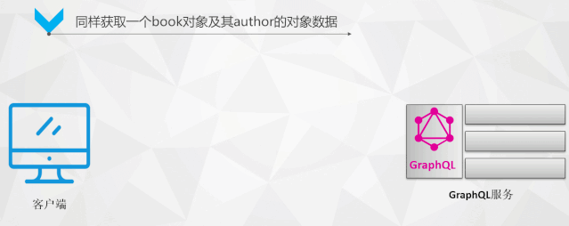
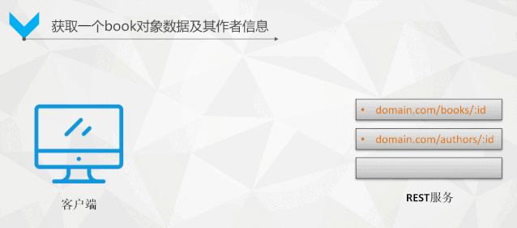
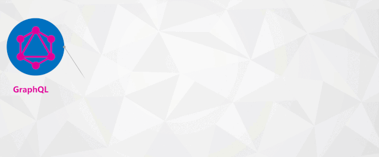

# GraphQL

[link](https://mp.weixin.qq.com/s?__biz=MzU0MzQ5MDA0Mw==&mid=2247491985&idx=1&sn=d2b2f0d817e24bf77944d3c0d202dcad&chksm=fb080b05cc7f82136060537460551911b809cfc0cd0a44e9a8e25abfa1d6a6ea488b6064284e&scene=0&xtrack=1#rd)

## 基本概念

GraphQL是一种新的API标准，它提供了一种比REST更有效、更强大和更灵活的替代方案。

它是由Facebook开发并开源的，现在由来自世界各地的公司和个人组成的大型社区维护。

GraphQL本质上是一种基于api的查询语言，现在大多数应用程序都需要从服务器中获取数据，这些数据存储可能存储在数据库中，API的职责是提供与应用程序需求相匹配的存储数据的接口。

它是数据库无关的，而且可以在使用API的任何环境中有效使用，我们可以理解为GraphQL是基于API之上的一层封装，目的是为了更好，更灵活的适用于业务的需求变化。

## GraphQL查询图示

## RESTFul查询图示

## GraphQL 思考模式 
使用GraphQL接口设计获取数据需要三步:

1、首先要设计数据模型，用来描述数据对象，它的作用可以看做是VO，用于告知GraphQL如何来描述定义的数据，为下一步查询返回做准备；

2、前端使用模式查询语言（Schema）来描述需要请求的数据对象类型和具体需要的字段（称之为声明式数据获取）；

3、后端GraphQL通过前端传过来的请求，根据需要，自动组装数据字段，返回给前端。

## GraphQL特点总结

声明式数据获取（可以对API进行查询）: 声明式的数据查询带来了接口的精确返回，服务器会按数据查询的格式返回同样结构的 JSON 数据、真正照顾了客户端的灵活性。

一个微服务仅暴露一个 GraphQL 层：一个微服务只需暴露一个GraphQL endpoint，客户端请求相应数据只通过该端点按需获取，不需要再额外定义其他接口。

传输层无关、数据库技术无关：带来了更灵活的技术栈选择，比如我们可以选择对移动设备友好的协议，将网络传输数据量最小化，实现在网络协议层面优化应用。

## GraphQL的核心概念：图表模式（Schema）
要想要设计GraphQL的数据模型，用来描述你的业务数据，那么就必须要有一套Schema语法来做支撑。

想要描述数据，就必须离不开数据类型的定义。所以GraphQL设计了一套Schema模式（可以理解为语法），其中最重要的就是数据类型的定义和支持。

那么类型（Type）就是模式（Schema）最核心的东西了。

### 什么是类型？

对于数据模型的抽象是通过类型（Type）来描述的，每一个类型有若干字段（Field）组成，每个字段又分别指向某个类型（Type）。这很像Java、C#中的类（Class）。

GraphQL的Type简单可以分为两种，一种叫做Scalar Type(标量类型)，另一种叫做Object Type(对象类型)。

----
[Back](sql-summary.md)
--
